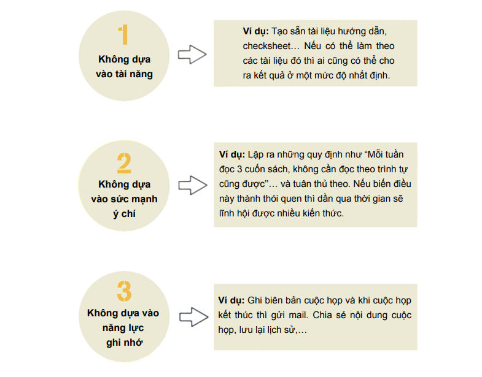

# Kỹ năng hệ thống hóa công việc

## PART 1 - "Hệ thống hóa" thay đổi công việc của bạn

### 1 - Vì sao cần "Hệ thống hóa"

- Ngay cả sản phẩm được yêu thích mà không hệ thống hóa thì cũng không thể triển khai áp dụng được.
- Cần có một hệ thống để khi có vấn đề gì xảy ra thì người khác cũng có thể xử lý được.
- Làm việc trong thời gian dài làm hạn chế ý tưởng sáng tạo.

👉 Nếu lúc nào cũng bận rộn và bị cuốn theo những công việc trước mắt sẽ khó trưởng thành trong tương lai. Điều quan trọng là phải thay đổi phong cách làm việc!

### 2 - "Bức tường" giữa những người thành công và những người không thành công

👉 Có những bức tường không thể vượt qua chỉ với tài năng và nỗ lực của bản thân. Để vượt qua được những bức tường đó, cần phải có "Hệ thống hóa"!

### 3 - Thế nào là tạo lập "hệ thống"?

👉 "Hệ thống" ở đây là chỉ qui trình để dù ai thực hiện công việc vào lúc nào hay bao nhiêu lần cũng sẽ cho ra cùng một kết quả.

Giả dụ, tại một công ty buôn bán sản phẩm giá 3 vạn yên, có một nhân viên đều đặn mang về cho công ty 10 hợp đồng mỗi ngày. Nếu chỉ nhìn vào năng lực kinh doanh của cá nhân và thành tích thực tế của cá nhân thì anh ta quả là rất xuất sắc.

Thế nhưng nếu như có 1 nhân viên không chỉ quan tâm đến việc nâng cao thành tích cá nhân mà còn tiến hành tạo lập "hệ thống" như là ghi chép lại những kiến thức kinh doanh thành một bản hướng dẫn và giúp đào tạo ra 10 cấp dưới có khả năng mang lại 8 hợp đồng mỗi ngày cho công ty thì hẳn là nhân viên này sẽ được đánh giá cao hơn.

"Nhân viên giỏi" của thời hiện đại hẳn phải là người vừa có năng lực chuyên môn, vừa có khả năng "hệ thống hóa" năng lực đó.

👉 Nhân viên có năng lực là người giỏi trong việc tạo lập hệ thống.

### 4 - Những công việc cần "hệ thống hóa" và những công việc không cần "hệ thống hóa"

🟦 **Công việc theo kiểu quy trình**

Là công việc có thể xử lý mà không cần dùng đến trí óc hay những công việc thực tế cần sử dụng chân tay.

Ví dụ như công việc văn thư, lập sổ cái, chuẩn bị cho cuộc họp hay tiến hành phiên họp, thu dọn sắp xếp bàn làm việc,...

🟦 **Công việc theo kiểu tư duy**

Là công việc cần phải sử dụng đầu óc để suy nghĩ, tính toán. Hay còn gọi là công việc trí óc.

Ví dụ như lên kế hoạch cho công việc kinh doanh mới, soạn thảo và đề xuất bản kế hoạch, bắt tay vào làm bản phác thảo, suy nghĩ về chiến lược kinh doanh, đánh giá nhân sự,...

👉 Nâng cao triệt để hiệu suất cho "Công việc theo kiểu quy trình", là công việc có thể xử lý được mà không cần dùng đầu óc, sử dụng thời gian tiết kiệm được cho "Công việc theo kiểu tư duy"!

### 5 - Giao tiếp cũng có thể được "hệ thống hóa"

Chúng ta có thể "hệ thống hóa" rất nhiều hành động khác nhau liên quan đến giao tiếp như là chuẩn bị cho công việc bán hàng, viết lời chào hàng, quy trình từ khi đón khách cho đến lúc tiễn khách ra về, chuẩn bị nội dung để hỏi đối phương trong buổi phỏng vấn,...

👉 Nếu "hệ thống hóa" được những công việc trên thì chúng ta có thể tập trung vào đúng nội dung của vấn đề được trao đổi trong khi giao tiếp.

### 6 - Ngừng suy nghĩ rằng "Tự mình làm sẽ nhanh hơn"

"Phiền phức" còn có một loại như thế này.

"Giải thích cách làm cho cấp dưới rất phiền nên tôi sẽ tự làm luôn."

Đây cũng là một lối suy nghĩ rất nguy hiểm.

👉 Nếu vượt qua "phiền phức" để tạo lập "hệ thống" thì chúng ta sẽ có nhiều thời gian dành cho công việc theo kiểu tư duy hơn và có thể đạt được nhiều thành quả lớn hơn!

### 7 - 3 quy tắc vàng của nghệ thuật tạo "hệ thống"

👉 **Không dựa vào "tài năng", "sức mạnh ý chí" và "năng lực ghi nhớ"**

<p align="center" width="100%"></p>

👉 Dựa vào tài năng, sức mạnh ý chí, hay năng lực ghi nhớ để xúc tiến công việc cũng chỉ là nhân viên hạng nhì mà thôi. Nhân viên hạng nhất sẽ tạo lập "hệ thống" chứ không dựa vào những thứ đó.

## PART 2 - Tạo lập hệ thống cho công việc của bản thân

### 1 - Hệ thống hóa trải nghiệm thành công

**Hệ thống hóa những trải nghiệm thành công khi công việc suôn sẻ**

Giả dụ có một người rất kém trong việc thuyết trình. Mỗi khi có cuộc họp hay phải phát biểu, người đó đều chuẩn bị rất nhiều tài liệu và thử thay đổi cách nói chuyện,v.v… nhưng vẫn không thể tiến hành một cách suôn sẻ. Thế rồi một ngày, anh ta đã thực hiện được một buổi thuyết trình nhận được phản hồi rất tích cực.

Nếu là bạn, bạn sẽ làm gì khi đó?

Đừng chỉ dừng lại ở việc nghĩ rằng "Hôm nay tự nhiên mọi việc diễn ra suôn sẻ. Thật tốt quá!". Quan trọng là phải phân tích được lý do vì sao ngày hôm đó đã diễn ra suôn sẻ. Khi thuyết trình mình đã mặc trang phục như thế nào, mình đã dành bao nhiêu thời gian để soạn thảo kịch bản nói, nội dung thuyết trình và tài liệu Power Point có gì khác so với những lần trước, tông giọng và cử chỉ như thế nào, những câu đùa nào được người nghe hưởng ứng,v.v…

Việc rút ra những dữ liệu về cách làm khi công việc diễn ra suôn sẻ như trên chính là bước đầu tiên của việc "hệ thống hóa" trải nghiệm thành công. Nếu ta dựa vào đây để tạo ra những phong cách thuyết trình phù hợp với bản thân thì từ lần sau đó ta sẽ có thể vững vàng hơn khi bước vào buổi thuyết trình.

Nếu như lần tiếp theo không được suôn sẻ bằng thì lúc đó chỉ cần cải tiến lại "hệ thống". Và cứ tiếp tục cải tiến thì ta sẽ dần nhận được một "hệ thống" chính xác, hoàn chỉnh hơn.

Mấu chốt chính là ở chỗ ta không phải tốn thời gian công sức bắt đầu lại từ con số không sau mỗi lần thất bại.

👉 Điểm mấu chốt của "hệ thống" là có tính tái hiện. Hãy phân tích cách làm thành công và tạo các mẫu mà nếu làm theo nhất định sẽ thành công.

### 2 - "Hệ thống hóa" những công việc mang tính thủ tục

- Ví dụ như việc chuẩn bị đồ dùng khi đi du lịch, đi công tác

👉 Đừng tốn thời gian và suy nghĩ cho những công việc thường xuyên lặp lại. Hãy vận dụng "hệ thống" để có thể hoàn thành việc này một cách nhanh chóng, hoàn hảo mà không cần phải suy nghĩ.

### 3 - "Hệ thống hóa" những công việc thường nhật

Việc tạo lập "hệ thống", nâng cao hiệu suất một cách triệt để mang một ý nghĩa rất lớn.

> "Quỹ thời gian của mỗi người đều như nhau. Nếu như không biết cách sử dụng thời gian hiệu quả thì khó đạt thành công lớn."
>
_Hiromasa Ezoe (Trích trong "Recruit DNA", Kadokawa one theme 21)_

> "Bí quyết chính là cách sử dụng thời gian. Bởi lẽ sử dụng thời gian thế nào cho hiệu quả chính là bí quyết."

_Den Fujita (Trích trong cuốn sách bán chạy nhất "Nghệ thuật kinh doanh (3) của Den Fujita - Cách thổi bùng niềm đam mê làm giàu")_

👉 "Hệ thống hóa" mang lại những hiệu quả như rút ngắn thời gian lao động, nâng cao thành tích công việc. Thêm vào đó, nếu sử dụng thời gian có được nhờ hệ thống hóa cũng giúp cho bản thân trưởng thành.

### 4 - Tạo thời gian cho bản thân nhờ "hệ thống hóa"

👉 Tạo lập "hệ thống" là cách đầu tư thời gian cho bản thân trong tương lai.

👉 Tạo lập hệ thống trong lúc bận rộn thì ban đầu sẽ thấy phiền hà nhưng nếu đã tạo lập 1 lần rồi thì sau đó sẽ thấy công việc nhàn hạ hơn.

### 5 - Có thật là bạn đang "bận rộn"?

💥**Đừng lấy "Bận rộn" và "Không có thời gian" làm cái cớ!**

👉 "Vấn đề là ở chỗ người ta thường nghĩ rằng "bận rộn" = "không thể làm thêm việc gì nữa". Nghĩa là họ đã từ bỏ nỗ lực để tăng hiệu suất công việc và tự hạ thấp khả năng của bản thân.

Do vậy, nếu có ai đó đang tự nhận thấy mình "bận rộn" thì xin hãy bình tĩnh và tự hỏi lại bản thân. Sự bận rộn đó liệu đã bằng những nhà quản lý của những công ty lớn? Hay liệu rằng bạn có bị thời gian dồn ép nhiều như thủ tướng, tổng thống của một nước chưa? Chỉ cần nghĩ vậy thôi bạn sẽ thấy là "vẫn chưa thấm vào đâu so với họ".

👉 Có thể nói "thay đổi cách suy nghĩ" chính là bước đầu tiên trong việc tạo lập "hệ thống".

👉 Bận rộn chính là cơ hội để trưởng thành. Nhờ việc tạo lập"hệ thống" mà công việc sẽ tiến được tới bước tiếp theo.

### 6 - Vận hành nhóm bằng "hệ thống"?

Đây là loại "hệ thống" cần thiết đối với người quản lý. Chỉ cần tạo lập được "hệ thống" thì dù là ai thực hiện, vào lúc nào và bao nhiêu lần thì công việc cũng sẽ được tiến hành một cách hiệu quả như nhau. Điều này áp dụng được cả trong công việc của bản thân và cả trong quản lý điều hành con người.

```
"Trong nghiệp vụ quản lý, có nhiều người đang quy chụp "Việc quản lý là quản lý con người". Tuy nhiên điều này là sai. Vì khi nghĩ là "quản lý con người" thì tự nhiên lại thành phán đoán, đánh giá xem là thích hay ghét một người nào đó.
(Trích lược)
Vậy, nghiệp vụ quản lý thì phải quản lý cái gì? Đó là quản lý công việc. Nếu là công việc thì không liên quan đến việc yêu hay là ghét. Do đó, càng quản lý được công việc thì tổ chức sẽ càng trở nên rõ ràng."
Koyama Noboru (Trích trong cuốn "Hãy tạo lập hệ thống có lợi", nhà xuất bản Kawade Shobo Shinsha)
```

👉 Nếu tạo lập được "hệ thống" thì có thể xử lý công việc suôn sẻ mà không phụ
thuộc vào kĩ năng hay hứng thú làm việc của cấp dưới.

### 7 - Tạo lập "hệ thống" cũng quan trọng người mới và người trẻ tuổi

👉 Điều quan trọng với người mới và người trẻ tuổi là "bắt chước người thành công"

_"Nếu dùng tri thức và kinh nghiệm của người khác làm đòn bẩy cho động lực của bản thân thì bạn sẽ có khả năng đạt được kết quả lớn gấp hàng chục, à không hàng trăm lần"_

👉 Hãy bỏ qua lòng tự tôn, lấy kinh nghiệm và tri thức từ đàn anh, đồng nghiệp xung quanh hay từ những người đi trước trong những cuốn sách kinh doanh, và biến nó thành của mình.

👉 Khả năng của mỗi người đều có giới hạn. Con đường ngắn dẫn đến thành công là bắt chước theo người thành công và sử dụng "hệ thống".

### 8 - "Hệ thống hóa" cả những sách lược đối phó với vấn đề rắc rối

🟦 Công việc luôn đi kèm với những sai sót và rắc rối. Dù bạn có để ý làm việc đến thế nào thì cũng sẽ xuất hiện lỗi sai ở những chỗ mà bạn chẳng ngờ tới.

Hoặc cũng có trường hợp xảy ra sai sót trong khi thực hiện lần thứ 2, thứ 3 một dự án mà bạn đã thành công trước đó. Hoặc đôi khi, dù bản thân không hề mắc lỗi nhưng lại bị cuốn vào rắc rối nào đó dẫn tới kết quả là gây ra bao nhiêu rắc rối cho mọi người xung quanh.

Dù cho bạn có là nhà kinh doanh, quản lý thì cũng sẽ xảy ra những chuyện như vậy. Dù có khiển trách cấp dưới là "Không được phép thất bại" "Hãy sửa chữa sai sót đi" nhưng trên thực tế ta vẫn thất bại và không thể hết được những sai sót.

Dù có cố gắng đến thế nào, ta cũng không thể đưa xác suất mắc lỗi và gặp rắc rối về con số 0.

Nếu vậy thì, chỉ cần suy nghĩ để tạo lập một "hệ thống" như sau cho công việc là được.
- Tạo "hệ thống" để có thể giảm tối đa khả năng xảy ra sai sót và rắc rối
- Tạo "hệ thống" để nếu phát sinh sai sót hay rắc rối thì cũng có thể phát hiện được ngay từ sớm
- Tạo "hệ thống" để có thể xử lý nhanh chóng ngay khi phát sinh sai sót và rắc rối

👉 Khi xảy ra sai sót và rắc rối, thì sẽ xem xét điều chỉnh lại "hệ thống" mà không đổ lỗi cho "người khác".

### 9 - Tạo "hệ thống" giúp hoàn thành "hệ thống"

👉 "Cứ tạo ra là xong" là suy nghĩ sai lầm. Cần cải tiến để "hệ thống" luôn khả dụng
- Nếu công việc có vẻ không trôi chảy, có vấn đề xảy ra thì điều đó có nghĩa là bản thân "hệ thống" đang có điểm cần cải tiến.
- Cấp dưới đã có thể thực hiện được công việc của cấp trên hay chưa, và khi vắng mặt cấp trên thì nhóm có thể làm việc hay không?

👉 Việc sử dụng "hệ thống" rất có ý nghĩa. Chúng ta hãy luôn suy nghĩ về "hệ thống" mà tất cả các thành viên trong nhóm đều có thể sử dụng được.

### 10 - Tạo lập "hệ thống" giúp duy trì động lực làm việc

👉 Điều quan trọng là có thể tiếp tục kể cả khi không có ý chí mạnh mẽ và bản lĩnh kiên cường

- Mặc dù ban đầu có rất nhiều động lực nhưng thường không kéo dài, đó là tình trạng mà ai cũng gặp phải.
- Nếu chỉ cố gắng và trông chờ vào vận may mà không hề sử dụng "hệ thống" thì mọi việc không thể diễn ra suôn sẻ được. Ngược lại thì, chỉ cần tiếp tục thực hiện thì 90% công việc sẽ diễn ra suôn sẻ. Và do đó ta cần tạo "hệ thống" để có thể tiếp tục thực hiện.

👉 Động lực sẽ tự nhiên dần dần suy giảm. Nếu có "hệ thống" thì chúng ta có thể duy trì được động lực mà không phụ thuộc vào ý trí hay tinh thần.

## PART 3 - Tối ưu hóa hiệu quả công việc theo kiểu quy trình bằng check sheet
### 1 - Hãy sử dụng triệt để checksheet
- Sử dụng checksheet để tăng tốc độ công việc và giảm căng thẳng.
- Xử lý "công việc theo kiểu quy trình" theo luồng công việc

👉 Không cần biết người phụ trách có phải là người ngăn nắp hay không, hay có phải là người có tài thu xếp công việc hay không. Cho dù là người mới, người có kinh nghiệm hay là ai thực hiện đi nữa thì đều có thể hoàn thành công việc ở một mức chuẩn giống nhau.

### 2 - 4 bí quyết tạo checksheet khả dụng

🟦 Tạo checksheet cho nội dung và trình tự công việc.
1. Phân chia thành "TO DO" (việc cần làm) và "chi tiết"
2. Cố gắng phân nhỏ công việc theo trình tự chi tiết nhất có thể
3. Không đưa yếu tố phán đoán vào
4. Tạo checksheet để ngay cả nhân viên làm thêm cũng có thể thực hiện được từ lần thứ 2

🟦 Tạo checksheet cho tất cả công việc theo kiểu quy trình

- Hãy thử tạo checksheet khả dụng cho tất cả các công việc để ngay cả người mới chưa quen việc và người làm thêm cũng có thể làm được.

### 3 - Tối ưu hóa triệt để danh sách công việc hàng ngày

## PART 4 - Sử dụng To do list để quản lý đồng bộ

### 1 - Nắm bắt căn bản của quản lý dữ liệu
👉 Quản lý đồng bộ, nói ngắn gọn là "không có cùng lúc 2 thứ giống nhau"

### 2 - 5 bí quyết để quản lý đồng bộ dữ liệu

- "Ghi chép" lên cloud tất cả những điều cần thiết
  - Quản lý đồng bộ dữ liệu bằng cloud
  - Đưa hết tất cả lên cloud
  - Không cần phân chia thư mục quá chi tiết
  - Tạo quy tắc đặt tên file
  - Tạo thư mục "Khác"

### 3 - Quản lý đồng bộ công việc bằng To do list

### 4 - Đưa tất cả task vào To do list
- Những công việc tiến hành hàng ngày, hàng tháng
- Những dự định dài hạn
- Những con số liên quan đến quản lý công ty
- Những việc chưa định rõ thời gian thực hiện
- Những mục tiêu hay câu nói giúp mình phấn chấn

### 5 - Giải quyết một lượt bắt đầu từ những việc đơn giản
👉 Bạn có thể tận hưởng cảm giác hoàn thành công việc bằng cách xử lý trước các công việc theo kiểu quy trình và sau đó chuyên tâm vào các công việc theo kiểu tư duy với tinh thần thoải mái!

### 6 - Ý tưởng hay xuất phát từ To do list

- Đặt remind định kỳ để ghi nhớ vào tiềm thức các công việc theo kiểu tư duy
  - Đưa các công việc theo kiểu tư duy vào To do list rồi cài đặt để có thể xác nhận theo chu kỳ chẳng hạn vào mỗi thứ 2 hàng tuần hay là vào ngày X hàng tháng

🟦 Nếu không hoàn thành task

Có 2 loại vấn đề như sau.
1. Task đó quá trừu tượng hoặc phức tạp nên không thể xử lý, giữa chừng bị ngừng lại
2. Bạn không muốn làm task đó

Nếu là trường hợp 1 thì bạn chỉ cần xem lại task rồi phân chia nhỏ task đó ra thành các hành động cụ thể là được. Còn nếu là trường hợp 2 có nghĩa là đây không phải thời điểm để làm task đó. Vậy nên bạn hãy từ bỏ và xóa sạch nó khỏi tâm trí. Khi nào bạn thấy nó thật sự cần thiết thì chỉ cần cho lại vào list là được.

👉 Đối với các công việc có khối lượng lớn nếu cứ để nguyên như vậy thì sẽ khó bắt đầu. Hãy chia nhỏ công việc sao cho có thể làm được luôn rồi giải quyết từng phần một.

### 7 - Tạo hệ thống cho việc xử lý mail

- Quy tắc 1: Trả lời ngay
- Quy tắc 2: Không tốn quá 5 giây cho việc phán đoán
- Quy tắc 3: Thu gọn đoạn văn trong vòng 20 dòng
- Quy tắc 4: Chuẩn bị từ 2 phương án lựa chọn trở lên
- Quy tắc 5: Quy tắc 24 giờ (nếu trongvòng 24 giờ không có phản đối hay ý kiến khác thì sẽ tự động được "phê duyệt".)

## PART 5 - Những điều "hệ thống hóa" hướng tới là gì?

### 1 - 7 thói quen của nghĩ theo kiểu "người hệ thống suy "
1. Luôn chú ý đến việc đơn giản hóa
2. Suy nghĩ một cách đơn giản
3. Không ghi nhớ mà ghi chép
4. Hỏi khi không biết
5. Phán đoán công việc của mình bằng lương theo giờ
6. Bắt chước những người thành công
7. Đưa bản thân vào khuôn khổ

### 2 - Hãy bắt đầu tạo lập hệ thống bằng cách viết ra

👉 "Hệ thống hóa" giúp tạo ra sự khác biệt gấp trăm lần

👉 Giá trị thêm vào mà một người tạo ra được, sau này sẽ trở thành sự khác biệt gấp trăm lần

👉 Bước đầu của tạo lập "hệ thống" là viết ra từng công việc của bản thân rồi dần dần tạo
thành 1 danh sách.

### 3 - Ai cũng có thể nhờ "hệ thống hóa" đạt kết quả

👉 Thực hiện hệ thống hóa có rất nhiều ưu điểm giúp công việc trở nên dễ dàng hơn. Tuy nhiên, mục tiêu hướng đến lại không phải là công việc dễ dàng. Hãy sử dụng thời gian tiết kiệm được cho những công việc có năng suất cao.
